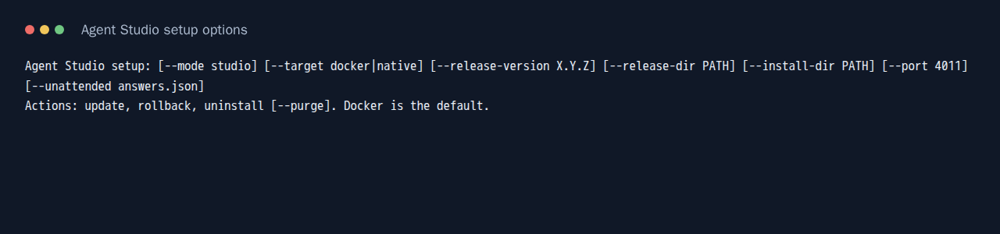
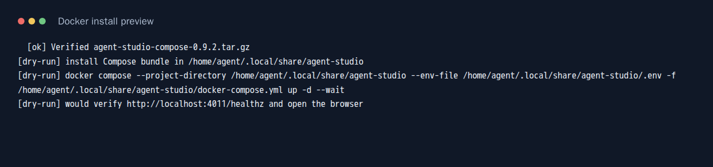

# Install Agent Studio

Download `agent-studio-setup` for Linux x64 or `agent-studio-setup.exe` for
Windows x64 from a [verified release](https://github.com/agent-orc/agent-studio/releases).
Download `SHA256SUMS` from the same release and compare the executable's SHA-256
hash before running it. By default it selects the latest published release;
`--release-version` pins a specific tag. It downloads the matching Compose
bundle and checks its hash against `SHA256SUMS`. An offline directory containing
the Compose bundle and `SHA256SUMS` can be supplied with `--release-dir`.
The Windows executable is Authenticode signed when the release pipeline has
`WINDOWS_CODESIGN_PFX` and its password configured. Otherwise the release
publishes an unsigned executable; a signing certificate is an operator purchase.

## One machine with Docker

Install Docker Engine with the Compose plugin on Linux, or Docker Desktop with
the WSL2 backend on Windows. Start Docker, then run the executable:

```sh
./agent-studio-setup
```

```powershell
.\agent-studio-setup.exe
```

The interactive flow asks for the runtime and browser port. Accept `docker`
and `4011` to install the one machine stack with Task Server, Engine, Studio
API, BFF, web UI, and one runner container. It creates a persistent named
volume for data and one for 0600 principal secrets. The installer waits for
Compose health checks and `http://127.0.0.1:4011/healthz`, then opens the UI.
No source checkout or .NET runtime is needed. Git and provider credentials are
only needed when you configure a project to run coding tasks.





These captures show the executable's help and dry-run output. The dry run
performs prerequisite and checksum checks without starting containers.

For unattended setup, save an answer file such as:

```json
{
  "mode": "studio",
  "target": "docker",
  "releaseVersion": "0.9.2",
  "port": 4011
}
```

Run `agent-studio-setup --unattended answers.json`. The release version must
match an available release. `--release-dir` and `--install-dir` can also be set
in the answer file or on the command line; command line values win. Do not put
credentials in the answer file. The bootstrap container generates them inside
the protected Docker volume.

The installed Compose files and configuration live under
`%LOCALAPPDATA%\AgentStudio` on Windows and
`${XDG_DATA_HOME:-~/.local/share}/agent-studio` on Linux. The browser binds to
loopback. The [Docker operations guide](./docker.md) explains credential mounts,
project setup, backup, and network exposure. Docker Desktop requires a paid
subscription for larger companies; Docker Engine installed directly on Linux
does not. See [Docker's Windows installation terms](https://docs.docker.com/desktop/setup/install/windows-install/)
and [Docker Engine licensing](https://docs.docker.com/engine/install/) before
choosing a runtime.

## Update, rollback, and uninstall

`agent-studio-setup update` selects the latest published release by default.
Use `--release-version X.Y.Z` to select a specific release. The installer
verifies the Compose bundle, pulls candidate images, starts the candidate,
checks health, and records the previous version for `agent-studio-setup
rollback`. It retains the previous image tags. If a candidate fails health,
the installer restores the prior Compose bundle and tag and starts it again.
Back up the Task Server before updating; application data migrations may not
support a downgrade.

`agent-studio-setup uninstall` stops and removes containers while retaining
data volumes and local configuration. `agent-studio-setup uninstall --purge`
also removes the volumes and local installation directory. `--purge` is
irreversible.

## Native and remote installations

The full native Studio profile is not yet in the release package. Selecting
`--target native` stops with an actionable error; it does not claim a working
Studio. Windows operators who need a local Task Server, Engine, and connector
can use the [Windows fallback profile](./windows-fallback-runbook.md), which
installs scheduled tasks and retains data on uninstall by default. It does not
include the full Studio UI or runner. Linux operators can use the existing
[guided systemd control plane and runner flow](./multi-machine.md).

For a remote Task Server, use the
[Docker control plane guide](./control-plane-docker.md) and join a runner through
the [multi-machine guide](./multi-machine.md). The Windows connector's route
coverage is described in the [connector gap](./docker-compose-connector-gap.md).
