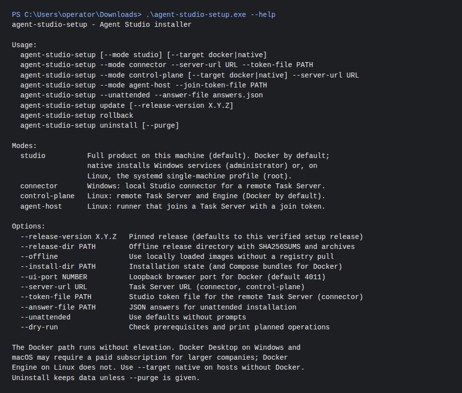
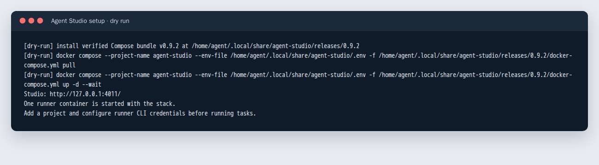

# Install Agent Studio

The `agent-studio-setup` release executable installs the pinned one-box Docker
stack by default, or native services with `--target native` on hosts without
Docker. The Linux binary and Windows `.exe` are single-file, self-contained
applications. Download the newest published release from the
[Agent Studio releases page](https://github.com/agent-orc/agent-studio/releases/latest).
The executable's release version is the default image tag. It verifies the
versioned Compose archive against the release `SHA256SUMS` before use.

## Docker installation

Install and start Docker Engine with Compose v2 on Linux, or Docker Desktop with
the WSL2 backend on Windows. Check `docker compose version` and `docker info`.
Docker Desktop on Windows and macOS requires a paid subscription for larger
companies; Docker Engine on Linux does not. The Docker installation runs as
your user and does not request elevation. The Windows executable reports
the Docker Desktop install link if Docker or WSL2 is unavailable.

On Ubuntu, download and verify the assets:

```bash
curl -fLO https://github.com/agent-orc/agent-studio/releases/latest/download/agent-studio-setup
curl -fLO https://github.com/agent-orc/agent-studio/releases/latest/download/SHA256SUMS
grep '  agent-studio-setup$' SHA256SUMS | sha256sum -c -
chmod +x agent-studio-setup
./agent-studio-setup
```

On Windows PowerShell, download `agent-studio-setup.exe` and `SHA256SUMS` from
the same release. Compare the SHA-256 value for the executable:

```powershell
(Get-FileHash .\agent-studio-setup.exe -Algorithm SHA256).Hash
.\agent-studio-setup.exe
```

The default UI is [http://127.0.0.1:4011](http://127.0.0.1:4011). The stack
includes one runner container. A one-shot bootstrap creates principal tokens
in a persistent Docker volume with mode `0600`. The installer writes its
versioned Compose bundles, `.env`, and state to
`~/.local/share/agent-studio` on Linux or `%LOCALAPPDATA%\AgentStudio` on
Windows. It waits for Compose services and the browser health endpoint.
Configure provider CLI and Git credentials for the runner before executing
coding tasks; see [Docker operations](./docker.md). The current one-box API
has the [documented route-coverage limit](./docker-compose-connector-gap.md).

## Unattended install, offline bundle, update, and removal

An answer file can provide the mode, target, release, port, and connector
values (`serverUrl`, `tokenFile`):

```json
{
  "mode": "studio",
  "target": "docker",
  "uiPort": 4011,
  "releaseDirectory": "/path/to/release-assets"
}
```

Run `agent-studio-setup --unattended --answer-file answers.json` (or the
`.exe` on Windows). The release directory must contain the versioned
`agent-studio-compose-<version>.tar.gz` and `SHA256SUMS`. The installer still
pulls images from the registry. Add `--offline` when the pinned images have
already been loaded into Docker on an isolated host; this skips the pull and
prevents Compose from pulling a missing image.

Use a newer verified executable and run `agent-studio-setup update` to pull
its version, retain the previous images and Compose bundle, and verify health.
`agent-studio-setup rollback` restores the previous version. An unsuccessful
update attempts to restart the installed version. Run
`agent-studio-setup uninstall` to stop and remove containers while retaining
the data volumes; add `--purge` to remove the volumes and installer files.

## Installation journeys, preflight, and re-runs

`agent-studio-setup` is one installer for four journeys. `--journey` selects
the installer mode:

| Journey | Mode | Purpose |
| --- | --- | --- |
| `one-box` | `studio` | Whole system on one machine; a workstation is a placement |
| `join-host` | `agent-host` | Add a runner host to the existing Task Server |
| `attach-studio` | `connector` | Attach Studio to a remote Task Server |
| `relocate-authority` | `control-plane` | Move Task Server and engine to an always-on box |

Each run prints the journey's facts first: prerequisites, storage, release
pin, human identity, project origin, first runner and budgets. It then prints
the checkpoints the journey must reach. Run `agent-studio-setup preflight
--journey NAME [--server-url URL] [--backup-path PATH]` to check a host
without changing it. Install runs the same checks first. A failed check names
its recovery action; for example `wsl --install`, `wg-quick up wg0`, the
private CA certificate, or `chmod 600` for a token file. Checks that the
journey does not need report `n/a`. Docker and Compose are required only for
`--target docker`; a Windows connector does not require Hyper-V or 20 GiB
of repository space.

Preflight probes the existing authority that the run will contact. A
`join-host` run decodes its join token first and probes the authority URL in
that token. A malformed token fails before any check, and a `--server-url`
that differs from the token's URL is refused. `attach-studio` and
`relocate-authority` probe `--server-url`; an interactive connector install
asks for the URL and token file before preflight, so prompted values pass the
same checks. A journey that needs an authority fails the `Authority URL` check
when no URL is known. A fresh one-box or `--mode control-plane` install does
not probe the URL it is about to serve. Reachability is probed for `https`
and loopback `http` URLs. An unreachable authority reports a connectivity
failure; certificate trust is checked only for `https`, after a TLS handshake.
On Windows, execution runs in Linux
containers under Docker Desktop with WSL 2. The host advertises `linux-x64`.
There is no native Windows execution exemption from AGT-W51.

The installer writes an owner-only `installation.json` manifest. It records
the installation id, release pin, principal names, project origin, first
runner and budgets, and never secrets. Re-running install keeps the id,
principals and data. An interrupted install resumes when you rerun it with the
same release. An interrupted `update` resumes when rerun with its target
release; `installation.json` marks that pin as `updating` until health succeeds,
while `install-state.json` retains the observed running release. Finish the
interrupted update before rollback, so a stale previous-release pin cannot be
activated. A different release needs `update` or `rollback`, and the
installer rejects a downgrade over preserved data. Setup records a new release
pin only after that release passes artifact verification and before services
change. An unavailable or mistyped version therefore leaves no pin, and a
rerun with the corrected version proceeds. If another setup run changed
`installation.json` in the meantime, setup stops instead of overwriting it. Token and join-token files
must be owner-only; the installer does not accept secrets as arguments or in
answer files. `uninstall` keeps data and the manifest, so a later install
keeps the same installation id. Only `--purge` deletes them. On Linux native
hosts, pass the installed role (`--journey one-box` or `--journey join-host`),
and use `--target native` for a one-box host. The installer stops and disables
the owned systemd units; an explicit purge also deletes that role's local
configuration, release tree and state. On a Docker control-plane host, purge
removes the Compose volumes. The separately mounted off-host backup remains.
For delegated Linux modes, `--install-dir` selects the configuration root used
by both install and uninstall. An explicit purge removes that root and the
role's installed release and state; it does not delete the default
configuration root when a different root was selected.
`checkpoints.jsonl` records observed installer checkpoints with host,
platform, setup version and release provenance. A rollback records its release
as `retained`, not as verified in that run. A connector records
`authority-reachable` only for the install that probed the authority. Install
records identity bootstrap, authenticated canary and recovery checkpoint as
`not reached`; `accept` observes them. Linux native single and control-plane
manifests live under `/etc/agent-orchestrator`; the agent-host manifest lives
under `/etc/agent-host` (or `--install-dir` when supplied).

### Acceptance

After a one-box install, bootstrap the first human session, register the
canonical Git project origin, and enrol the first runner with finite coding
and review budgets. Until acceptance passes, a one-box `installation.json` has
phase `awaiting-acceptance`; service health alone does not change it to
`complete`. Then run acceptance on the authority host:

```bash
export AGENT_ORCHESTRATOR_CANARY_COMMAND='/path/to/detached-canary'
agent-studio-setup accept --server-url https://tasks.wg.internal \
  --token-file /path/to/management.token [--backup-path /path/to/backups]
```

`accept` reads the management token from an owner-only file and sends it only
to the Task Server. It stops at the first checkpoint it cannot observe. That
checkpoint is recorded as `not reached` with the next action, and the command
exits with code 2:

1. `identity-bootstrapped`: the Task Server accepts the token and lists active
   studio, engine and runner principals. A runner must have contacted it.
2. `recovery-checkpoint`: without `--recovery-checkpoint`, `accept` creates a
   [full backup set](./task-server.md#full-backup-sets) and has the Task Server
   verify it. That run records `recovery-set-verified` and names the set.
   Rehearse that set's restore into an isolated empty store, write
   `BACKUP_SET.rehearsal.json` as described for relocation below, and rerun
   with `--recovery-checkpoint BACKUP_PATH/full/BACKUP_ID`. The rerun
   recalculates the set's file and set hashes. It requires a rehearsal receipt
   for this installation id and a matching Task Server verification.
3. `authenticated-canary`: `accept` runs `AGENT_ORCHESTRATOR_CANARY_COMMAND`,
   the canary contract that `update-docker.sh` already uses. It is bounded to 60
   minutes. The command receives `AGENT_STUDIO_INSTALLATION_ID`,
   `AGENT_STUDIO_SERVER_URL` and `AGENT_STUDIO_TOKEN_FILE` (a path, never the
   token value). It must drive the provider-authenticated coding, review and
   canonical publication canary; the
   [deployment scenario](../testing/deployment-scenario.md) defines that
   evidence. An unset command leaves the checkpoint pending. A non-zero exit or
   timeout is recorded as `failed`.

When all three checkpoints are observed in the same run, `accept` records
`accepted` and sets the phase to `complete` (exit 0). It refuses to complete a
manifest that another setup run changed during the canary. A rejected token is
reported as an invalid credential. `accept` also applies to a relocated
authority after network cutover.

`relocate-authority` is the final certification step of the gated migration.
First drain the source, resolve every attempt, enter Maintenance and create a
full backup set. Verify it with `task-server backup verify-full BACKUP_ID` and
rehearse `restore-full` into an isolated empty store. Freeze the source and
retain its `installation.json`, D6 runtime manifest, credentials, repository
origins and network configuration. Stage the complete set in the new host's
Task Server backup directory, start that target in Maintenance, and place the
source `installation.json` at the destination configuration root. Follow the
[Task Server recovery procedure](./task-server.md#full-backup-sets) for the
data and archive paths.
Keep the old authority in Maintenance until cutover is proven.

Record the rehearsal result in `BACKUP_SET.rehearsal.json`, beside the backup
set directory. Its JSON fields are `backupId`, `setSha256`, `installationId`,
`verified: true` and `restoredIntoEmptyTarget: true`; use the id and hash from
the Task Server verify result. Run:

```bash
agent-studio-setup --journey relocate-authority \
  --source-manifest /path/to/source/installation.json \
  --recovery-checkpoint /path/to/full-backup/BACKUP_ID \
  --authority-frozen --backup-path /path/to/offhost-backups \
  --server-url https://new-authority.wg.internal \
  --token-file /path/to/target-management.token
```

The installer recalculates the full set's file and set hashes and compares
the staged installation id, release, principal names and project origin
with the frozen source. It then calls the target's authenticated full-set
verify and restore endpoints in that order. Task Server calculates an identity
digest from the verified snapshot's authority id, principals, human accounts,
projects and project URLs, then checks the live store against it after restore.
The installer requires matching verify and restore digests and rereads the
destination manifest before marking relocation complete. It refuses a missing
target, changed identity, damaged set, failed API verification or missing
rehearsal receipt. It does not start a fresh Task Server over restored data. The freeze
and rehearsal receipt are operator evidence; the installer cannot independently
observe the old host's mode. Keep admission closed until the authenticated
canary, private HTTPS cutover and recovery check pass; run `accept` on the
new authority for that. A completed relocation records the set hash it restored.
A rerun with that same recovery set does not restore it again. An authority
that was installed in control-plane mode or relocated earlier is still
restored from a new set. Setup sends the Task Server protocol header on every
management call.

### Check installation facts in Studio

Open Workspace Settings, then Execution Hosts. The Installation checkpoints
section reads the Task Server installation id and owner bootstrap state, the
current human session and browser origin, each registered project's canonical
repository and latest per-runner origin probe, the server release reference,
and the full-backup inventory. The host rows below it show the observed daemon
versions, role slot budgets and capability freshness. A role progresses from
enrolled to connected to capability ready; a project still needs its own
repository proof and placement admission. A successful host probe from another
project or runner does not establish this project's access.

Studio cannot infer installation completion from service health, or a verified
recovery from a listed backup. Read `installation.json` and `checkpoints.jsonl`
on the authority host for the accepted release, canary and phase. Check the
off-host set, its integrity verification, matching empty-target rehearsal
receipt and restored inventory before declaring recovery complete. A missing
checkpoint names its action in the panel; refresh after repairing it. Keep
the AGT-2739 fake-CLI scenario separate from the provider-authenticated
coding, review and publication canary required by `accept`.

## Native installation without Docker

`--target native` installs services instead of containers. It is the path for
hosts without Docker, or where the Docker Desktop subscription does not fit.

On Windows, run the executable from an elevated terminal (or choose
**Run as administrator**). Only this path needs elevation:

```powershell
.\agent-studio-setup.exe --target native
```

It verifies `agent-orchestrator-<version>-win-x64.zip` against `SHA256SUMS`.
It then installs the [Windows fallback](./windows-fallback-runbook.md) (D6)
services as start-up scheduled tasks, using the primary-profile settings:

| Service | Scheduled task | Endpoint |
| --- | --- | --- |
| Task Server (mode Normal) | `AgentOrchestrator-TaskServer` | `http://127.0.0.1:5071/readyz` |
| Orchestrator Engine | `AgentOrchestrator-Engine` | none |
| Studio connector | `AgentOrchestrator-StudioConnector` | `http://127.0.0.1:5031/healthz` |

Where the installer writes:
- Binaries go to `C:\AgentOrchestrator\release-<version>`, with a `current`
  junction pointing at the active release.
- Configuration and generated credentials go to `C:\ProgramData\AgentOrchestrator`.
  Credential files are readable only by the installing account (the tasks run
  as that account), SYSTEM, and Administrators.
- Installer state and task data go to `C:\ProgramData\AgentStudio`.

The installer waits for both endpoints before it reports success.

`update`, `rollback`, and `uninstall` work the same way as for Docker. An update
stops the tasks, activates the new release, and keeps configuration and data.
Rollback re-activates the previous staged release. `uninstall` removes the tasks
and binaries but keeps configuration and task data; `--purge` removes those too.

The win-x64 release does not yet contain the Studio web UI host or a runner.
The native Windows profile therefore provides the Task Server, Engine, and
connector APIs. The browser UI with a runner on a single Windows machine
requires the Docker path.

On Linux, `sudo ./agent-studio-setup --target native` runs the systemd
single-machine profile. It installs the Task Server, Engine, an agent host, and
the static Studio files. Update and roll it back with `update.sh` and
`rollback.sh` in `/opt/agent-orchestrator/current`; see
[multi-machine setup](./multi-machine.md).

## Connector and remote topologies

A Windows device can connect to a remote Task Server without running one
locally. From an elevated terminal:

```powershell
.\agent-studio-setup.exe --mode connector --server-url https://tasks.example.com --token-file .\studio.token
```

This installs only the Studio connector task on `http://127.0.0.1:5031`. The
token is copied to `C:\ProgramData\AgentOrchestrator` with restricted access.
The upstream must use HTTPS, or HTTP on a loopback address.
[switch-upstream.ps1](./windows-fallback-runbook.md) keeps working against the
configuration it writes. The backend connector profile with a pinned upstream
certificate ([D4b](./docker-compose-connector-gap.md)) is a separate profile.

For a remote Linux topology:
- `--mode control-plane` installs the Task Server and Engine with Docker
  Compose ([control-plane-docker.md](./control-plane-docker.md)). Add
  `--target native` (or `systemd`) for the systemd services.
- `--mode agent-host --join-token-file <path>` (or `--join`) joins a runner.

These remote modes accept the Linux options described in
[multi-machine setup](./multi-machine.md). Every mode translates `native` and
`systemd` the same way, with or without `--unattended` or `--answer-file`.

## Installer screens

These captures render the executable's actual help output and a dry run with
a simulated Docker command. They show the CLI flow, but do not prove a live
stack on Windows or Ubuntu.




